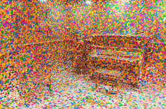
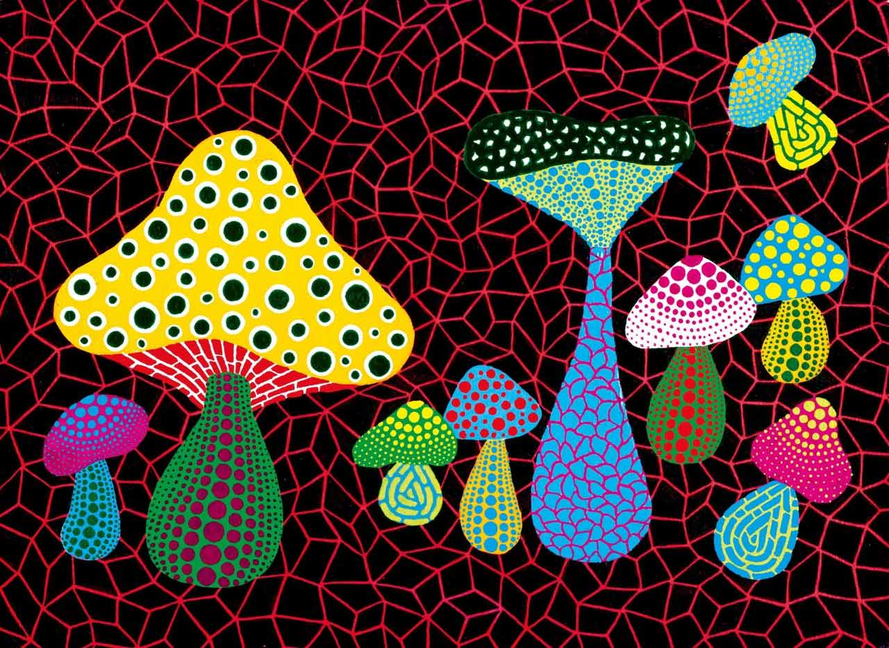
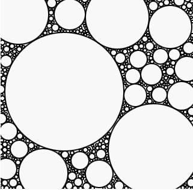

# zzhu0757_quiz_8
## Imaging Technique Inspiration
To inspire my creativity, the piece I chose was Yayoi Kusama Pop Art. I want to include these polka dots art in our final group assignment project, because I think these polka dots, although repeated and single design, will bring different feelings under differentcombinations.
Kusama's artistic style combined with P5.js programming can add a unique charm and creativity to my work, while also helping me improve my programming skills and artistic expression.
Here are some of the works I Googled that were very inspiring to me. 

## Coding Technique Exploration
To bring my work closer to these effects, I use loops and recursive functions to create infinitely repetitive patterns that generate patterns similar to those in Kusama's work. I also use color(), fill(), stroke(), etc. to help me achieve the vibrant color effects in Kusama's work. Yayoi Kusama's works usually have a certain degree of interactivity, and I will try to add some interactive elements to my P5.js works, such as mouse interaction or keyboard control.

[Click here to view the link to the technical implementation of this code](https://codepen.io/jpdrecourt/pen/wGGKVb）

[Click here to view the link to the technical implementation of this code](https://generativeartistry.com/tutorials/circle-packing/)
